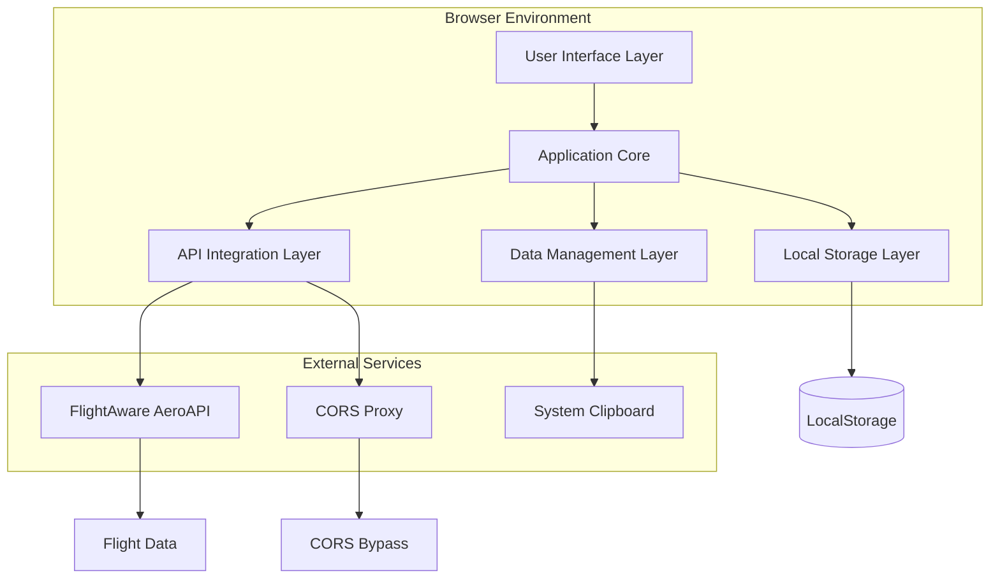

# Design Document

## Overview

Der FlightStat Bot ist eine moderne, standalone HTML5-WebApp für die Live-Überwachung von Flugankünften. Die Anwendung kombiniert eine elegante, dunkle Benutzeroberfläche mit intelligenter API-Integration und bietet professionelle Flugverfolgung für Desktop-Benutzer. Das Design folgt dem Single-File-Prinzip und nutzt moderne Web-Standards für optimale Performance und Kompatibilität.

## Architecture

### High-Level Architecture



### Component Architecture

Die Anwendung folgt einer modularen Klassenstruktur mit klarer Trennung der Verantwortlichkeiten:

```javascript
// Core Application Structure
class FlightStatBot {
    constructor() {
        this.flights = new Map();
        this.rateLimiter = new FlightAwareRateLimiter();
        this.apiManager = new AeroAPIManager();
        this.uiManager = new UIManager();
        this.dataManager = new DataManager();
        this.storageManager = new StorageManager();
    }
}
```

## Components and Interfaces

### 1. Core Application (FlightStatBot)

**Responsibility:** Zentrale Koordination aller Komponenten und Geschäftslogik

**Key Methods:**
- `initialize()`: App-Initialisierung und Setup
- `startMonitoring()`: Live-Update-Zyklus starten
- `stopMonitoring()`: Überwachung pausieren
- `updateFlights()`: Hauptupdate-Schleife

**Interfaces:**
```javascript
interface IFlightStatBot {
    flights: Map<string, Flight>;
    currentAirport: string;
    isMonitoring: boolean;
    
    initialize(): Promise<void>;
    setAirport(airportCode: string): void;
    importFromClipboard(): Promise<void>;
    exportData(format: string): void;
}
```

### 2. API Management (AeroAPIManager)

**Responsibility:** FlightAware AeroAPI Integration und Request-Handling

**Key Features:**
- Rate-Limiting-Compliance (10 req/min, 500/month)
- CORS-Proxy-Integration
- Error-Handling und Fallbacks
- Response-Caching

**Methods:**
```javascript
class AeroAPIManager {
    async getArrivals(airportCode, timeWindow = 5): Promise<Flight[]>
    async getFlightDetails(flightId): Promise<FlightDetails>
    async testConnection(): Promise<boolean>
    getRemainingCalls(): number
}
```

**API Endpoints:**
- `/airports/{airport_code}/flights/arrivals` - Ankunftsdaten
- `/flights/{flight_id}` - Detaillierte Fluginformationen
- Rate-Limit-Headers für Call-Tracking

### 3. Rate Limiting (FlightAwareRateLimiter)

**Responsibility:** Intelligente API-Call-Optimierung innerhalb der kostenlosen Limits

**Algorithm:**
```javascript
class FlightAwareRateLimiter {
    calculateUpdateInterval(activeFlightCount, remainingCalls) {
        if (remainingCalls < 50) return 1800;   // 30 min
        if (remainingCalls < 100) return 900;   // 15 min
        if (activeFlightCount < 20) return 600; // 10 min
        if (activeFlightCount < 50) return 360; // 6 min
        if (activeFlightCount < 80) return 240; // 4 min
        return 180; // 3 min (Peak)
    }
    
    shouldBoostFinalApproach(flight) {
        return flight.eta && 
               (flight.eta - Date.now()) < 30 * 60 * 1000 && // <30min
               this.canMakeRequest();
    }
}
```

### 4. Data Management (DataManager)

**Responsibility:** Flugdaten-Verarbeitung, Abgleich und Validierung

**Core Logic:**
```javascript
class DataManager {
    mergeFlightData(importedFlights, apiFlights) {
        // Priority: Callsign > FlightNumber > Registration > Origin
        const merged = new Map();
        
        for (const flight of importedFlights) {
            const key = this.generateFlightKey(flight);
            merged.set(key, flight);
        }
        
        for (const apiFlight of apiFlights) {
            const matchedKey = this.findMatchingFlight(apiFlight, merged);
            if (matchedKey) {
                this.updateFlightData(merged.get(matchedKey), apiFlight);
            } else {
                merged.set(this.generateFlightKey(apiFlight), apiFlight);
            }
        }
        
        return Array.from(merged.values());
    }
}
```

**Flight Data Model:**
```javascript
interface Flight {
    id: string;
    flightNumber: string;
    callsign: string;
    registration?: string;
    airlineICAO: string;
    originICAO: string;
    scheduledArrival: Date;
    estimatedArrival?: Date;
    actualArrival?: Date;
    delay: number;
    phase: FlightPhase;
    isMonitored: boolean;
    lastUpdated: Date;
    isNewOrUpdated: boolean;
}

enum FlightPhase {
    PRE_FLIGHT = 'Pre-Flight',
    EN_ROUTE = 'En Route', 
    APPROACH = 'Approach',
    LANDED = 'Landed',
    CANCELLED = 'Cancelled',
    DIVERTED = 'Diverted'
}
```

### 5. UI Management (UIManager)

**Responsibility:** DOM-Manipulation, Event-Handling und Benutzerinteraktion

**Key Components:**
- Header mit Airport-Selection und Status
- Haupttabelle mit Sortierung und Filtering
- Detail-Modal für Fluginformationen
- Settings-Modal für Konfiguration
- Notification-System

**Responsive Design:**
```css
/* Grid-System für verschiedene Bildschirmgrößen */
.flight-table {
    display: grid;
    grid-template-columns: 
        50px          /* Monitor Toggle */
        120px         /* Flight Number */
        100px         /* Callsign */
        100px         /* Registration */
        80px          /* Airline */
        80px          /* Origin */
        100px         /* STA */
        100px         /* ETA */
        80px          /* Delay */
        100px;        /* Phase */
    
    gap: 8px;
    min-width: 1200px;
}

@media (max-width: 1400px) {
    .flight-table {
        grid-template-columns: 
            40px 100px 90px 90px 70px 70px 90px 90px 70px 90px;
    }
}
```

### 6. Storage Management (StorageManager)

**Responsibility:** Lokale Datenpersistierung und Konfiguration

**Storage Schema:**
```javascript
interface StorageSchema {
    apiKey: string;           // Encrypted API Key
    flights: Flight[];        // Current flight list
    settings: {
        selectedAirport: string;
        updateInterval: number;
        notifications: boolean;
        filters: FilterSettings;
    };
    usage: {
        callsUsedThisMonth: number;
        lastResetDate: Date;
    };
}
```

**Encryption:**
```javascript
class StorageManager {
    encryptApiKey(apiKey) {
        const salt = this.generateSalt();
        return btoa(salt + apiKey);
    }
    
    decryptApiKey(encrypted) {
        const decoded = atob(encrypted);
        return decoded.substring(16); // Remove salt
    }
}
```

## Data Models

### Flight Data Structure

```javascript
class Flight {
    constructor(data) {
        this.id = data.id || this.generateId();
        this.flightNumber = this.normalizeFlightNumber(data.flightNumber);
        this.callsign = data.callsign?.toUpperCase();
        this.registration = data.registration?.toUpperCase();
        this.airlineICAO = this.extractAirlineICAO(data.flightNumber);
        this.originICAO = data.originICAO?.toUpperCase();
        this.scheduledArrival = new Date(data.scheduledArrival);
        this.estimatedArrival = data.estimatedArrival ? new Date(data.estimatedArrival) : null;
        this.actualArrival = data.actualArrival ? new Date(data.actualArrival) : null;
        this.phase = this.calculatePhase();
        this.isMonitored = data.isMonitored !== false; // Default true
        this.lastUpdated = new Date();
        this.isNewOrUpdated = true;
    }
    
    get delay() {
        if (!this.estimatedArrival) return 0;
        return Math.round((this.estimatedArrival - this.scheduledArrival) / 60000); // minutes
    }
    
    calculatePhase() {
        const now = new Date();
        
        if (this.actualArrival) return FlightPhase.LANDED;
        if (!this.estimatedArrival) return FlightPhase.PRE_FLIGHT;
        
        const timeToArrival = this.estimatedArrival - now;
        if (timeToArrival < 30 * 60 * 1000) return FlightPhase.APPROACH; // <30min
        
        return FlightPhase.EN_ROUTE;
    }
}
```

### Airport Data Model

```javascript
interface Airport {
    iata: string;     // 3-letter IATA code (FRA)
    icao: string;     // 4-letter ICAO code (EDDF)
    name: string;     // Full airport name
    city: string;     // City name
    country: string;  // Country name
    timezone: string; // Timezone identifier
}

// Embedded airport database (top 200 airports)
const AIRPORT_DATABASE = [
    { iata: 'FRA', icao: 'EDDF', name: 'Frankfurt Airport', city: 'Frankfurt', country: 'Germany', timezone: 'Europe/Berlin' },
    { iata: 'MUC', icao: 'EDDM', name: 'Munich Airport', city: 'Munich', country: 'Germany', timezone: 'Europe/Berlin' },
    // ... weitere Flughäfen
];
```

### Airline Data Model

```javascript
interface Airline {
    icao: string;     // 3-letter ICAO code (DLH)
    iata: string;     // 2-letter IATA code (LH)
    name: string;     // Full airline name
    country: string;  // Country of origin
    isCargo: boolean; // Cargo airline flag
}
```

## Error Handling

### API Error Management

```javascript
class APIErrorHandler {
    async handleAPIError(error, context) {
        switch (error.status) {
            case 401:
                this.showAPIKeyError();
                break;
            case 429:
                this.handleRateLimit(error.headers);
                break;
            case 500:
            case 502:
            case 503:
                this.activateFallbackMode();
                break;
            default:
                this.logError(error, context);
        }
    }
    
    activateFallbackMode() {
        // Switch to demo data or cached data
        this.uiManager.showFallbackNotification();
        this.dataManager.loadDemoData();
    }
}
```

### CORS Fallback Chain

```javascript
class CORSHandler {
    constructor() {
        this.proxyUrls = [
            'https://api.allorigins.win/raw?url=',
            'https://cors-anywhere.herokuapp.com/',
            'https://thingproxy.freeboard.io/fetch/'
        ];
        this.currentProxyIndex = 0;
    }
    
    async makeRequest(url, options) {
        for (let i = 0; i < this.proxyUrls.length; i++) {
            try {
                const proxyUrl = this.proxyUrls[this.currentProxyIndex] + encodeURIComponent(url);
                const response = await fetch(proxyUrl, options);
                if (response.ok) return response;
            } catch (error) {
                this.currentProxyIndex = (this.currentProxyIndex + 1) % this.proxyUrls.length;
            }
        }
        throw new Error('All CORS proxies failed');
    }
}
```

### Data Validation

```javascript
class DataValidator {
    validateFlightData(flight) {
        const errors = [];
        
        if (!flight.flightNumber || !this.isValidFlightNumber(flight.flightNumber)) {
            errors.push('Invalid flight number format');
        }
        
        if (flight.callsign && !this.isValidCallsign(flight.callsign)) {
            errors.push('Invalid callsign format');
        }
        
        if (!flight.scheduledArrival || isNaN(new Date(flight.scheduledArrival))) {
            errors.push('Invalid scheduled arrival time');
        }
        
        return errors;
    }
    
    isValidFlightNumber(flightNumber) {
        // Pattern: 2-3 letters + 1-4 digits (LH441, BA2156)
        return /^[A-Z]{2,3}\s?\d{1,4}$/.test(flightNumber.toUpperCase());
    }
    
    isValidCallsign(callsign) {
        // Pattern: 3 letters + 1-4 digits/letters (DLH441, BAW2156A)
        return /^[A-Z]{3}[A-Z0-9]{1,4}$/.test(callsign.toUpperCase());
    }
}
```

## Testing Strategy

### Unit Testing Approach

```javascript
// Test Framework: Embedded minimal test runner
class TestRunner {
    constructor() {
        this.tests = [];
        this.results = { passed: 0, failed: 0 };
    }
    
    test(name, testFunction) {
        this.tests.push({ name, testFunction });
    }
    
    async runAll() {
        for (const test of this.tests) {
            try {
                await test.testFunction();
                this.results.passed++;
                console.log(`✓ ${test.name}`);
            } catch (error) {
                this.results.failed++;
                console.error(`✗ ${test.name}: ${error.message}`);
            }
        }
    }
}

// Example Tests
const testRunner = new TestRunner();

testRunner.test('Flight data validation', () => {
    const validator = new DataValidator();
    const validFlight = { flightNumber: 'LH441', scheduledArrival: new Date() };
    const errors = validator.validateFlightData(validFlight);
    if (errors.length > 0) throw new Error('Valid flight failed validation');
});

testRunner.test('Rate limiter calculation', () => {
    const rateLimiter = new FlightAwareRateLimiter();
    const interval = rateLimiter.calculateUpdateInterval(10, 100);
    if (interval !== 900) throw new Error('Incorrect interval calculation');
});
```

### Integration Testing

```javascript
class IntegrationTester {
    async testAPIIntegration() {
        const apiManager = new AeroAPIManager('test-key');
        
        // Test with mock data
        const mockResponse = {
            arrivals: [
                {
                    ident: 'LH441',
                    registration: 'D-AIHF',
                    scheduled_in: '2025-01-15T14:30:00Z',
                    estimated_in: '2025-01-15T14:45:00Z'
                }
            ]
        };
        
        // Verify data transformation
        const flights = apiManager.transformAPIResponse(mockResponse);
        assert(flights.length === 1);
        assert(flights[0].flightNumber === 'LH441');
        assert(flights[0].delay === 15);
    }
    
    async testDataMerging() {
        const dataManager = new DataManager();
        
        const importedFlights = [
            { flightNumber: 'LH441', callsign: 'DLH441', scheduledArrival: new Date() }
        ];
        
        const apiFlights = [
            { flightNumber: 'LH441', registration: 'D-AIHF', estimatedArrival: new Date() }
        ];
        
        const merged = dataManager.mergeFlightData(importedFlights, apiFlights);
        assert(merged.length === 1);
        assert(merged[0].registration === 'D-AIHF');
    }
}
```

### Performance Testing

```javascript
class PerformanceTester {
    async testLargeDatasetHandling() {
        const startTime = performance.now();
        
        // Generate 100 test flights
        const flights = Array.from({ length: 100 }, (_, i) => ({
            flightNumber: `LH${1000 + i}`,
            callsign: `DLH${1000 + i}`,
            scheduledArrival: new Date(Date.now() + i * 60000)
        }));
        
        const uiManager = new UIManager();
        uiManager.renderFlightTable(flights);
        
        const endTime = performance.now();
        const renderTime = endTime - startTime;
        
        if (renderTime > 100) { // Should render in <100ms
            throw new Error(`Rendering too slow: ${renderTime}ms`);
        }
    }
    
    testMemoryUsage() {
        const initialMemory = performance.memory?.usedJSHeapSize || 0;
        
        // Create and destroy large dataset
        const largeDataset = Array.from({ length: 1000 }, () => new Flight({
            flightNumber: 'LH441',
            scheduledArrival: new Date()
        }));
        
        // Force garbage collection (if available)
        if (window.gc) window.gc();
        
        const finalMemory = performance.memory?.usedJSHeapSize || 0;
        const memoryIncrease = finalMemory - initialMemory;
        
        if (memoryIncrease > 10 * 1024 * 1024) { // 10MB threshold
            console.warn(`High memory usage: ${memoryIncrease / 1024 / 1024}MB`);
        }
    }
}
```

### Browser Compatibility Testing

```javascript
class CompatibilityTester {
    testBrowserFeatures() {
        const requiredFeatures = {
            'Clipboard API': 'navigator.clipboard',
            'LocalStorage': 'localStorage',
            'Fetch API': 'fetch',
            'ES6 Classes': 'class',
            'CSS Grid': 'CSS.supports("display", "grid")',
            'Notifications': 'Notification'
        };
        
        const unsupportedFeatures = [];
        
        for (const [feature, test] of Object.entries(requiredFeatures)) {
            try {
                if (!eval(test)) {
                    unsupportedFeatures.push(feature);
                }
            } catch (error) {
                unsupportedFeatures.push(feature);
            }
        }
        
        if (unsupportedFeatures.length > 0) {
            this.showCompatibilityWarning(unsupportedFeatures);
        }
    }
    
    showCompatibilityWarning(features) {
        const warning = `
            Ihr Browser unterstützt folgende Features nicht vollständig:
            ${features.join(', ')}
            
            Für die beste Erfahrung verwenden Sie bitte:
            Chrome 90+, Firefox 88+, Edge 90+, Safari 14+
        `;
        
        alert(warning);
    }
}
```

## Security Considerations

### API Key Protection

```javascript
class SecurityManager {
    constructor() {
        this.salt = this.generateSalt();
        this.sessionTimeout = 30 * 60 * 1000; // 30 minutes
        this.lastActivity = Date.now();
    }
    
    encryptApiKey(apiKey) {
        // Simple encryption for client-side storage
        const combined = this.salt + apiKey;
        return btoa(combined);
    }
    
    decryptApiKey(encrypted) {
        try {
            const decoded = atob(encrypted);
            return decoded.substring(this.salt.length);
        } catch (error) {
            return null;
        }
    }
    
    checkSessionTimeout() {
        if (Date.now() - this.lastActivity > this.sessionTimeout) {
            this.clearSensitiveData();
            return true;
        }
        return false;
    }
    
    updateActivity() {
        this.lastActivity = Date.now();
    }
    
    clearSensitiveData() {
        localStorage.removeItem('flightstat_apikey');
        localStorage.removeItem('flightstat_settings');
    }
}
```

### Input Sanitization

```javascript
class InputSanitizer {
    sanitizeFlightNumber(input) {
        // Remove special characters, keep only alphanumeric and spaces
        return input.replace(/[^A-Za-z0-9\s]/g, '').toUpperCase().trim();
    }
    
    sanitizeAirportCode(input) {
        // Only allow 3-4 letter codes
        const cleaned = input.replace(/[^A-Za-z]/g, '').toUpperCase();
        return cleaned.length >= 3 && cleaned.length <= 4 ? cleaned : '';
    }
    
    sanitizeCSVInput(csvData) {
        // Remove potentially dangerous content
        return csvData
            .replace(/<script\b[^<]*(?:(?!<\/script>)<[^<]*)*<\/script>/gi, '')
            .replace(/javascript:/gi, '')
            .replace(/on\w+\s*=/gi, '');
    }
}
```

## Performance Optimizations

### Efficient DOM Updates

```javascript
class DOMOptimizer {
    constructor() {
        this.updateQueue = new Map();
        this.isUpdateScheduled = false;
    }
    
    scheduleUpdate(elementId, updateFunction) {
        this.updateQueue.set(elementId, updateFunction);
        
        if (!this.isUpdateScheduled) {
            this.isUpdateScheduled = true;
            requestAnimationFrame(() => this.flushUpdates());
        }
    }
    
    flushUpdates() {
        for (const [elementId, updateFunction] of this.updateQueue) {
            const element = document.getElementById(elementId);
            if (element) {
                updateFunction(element);
            }
        }
        
        this.updateQueue.clear();
        this.isUpdateScheduled = false;
    }
}
```

### Memory Management

```javascript
class MemoryManager {
    constructor() {
        this.flightCache = new Map();
        this.maxCacheSize = 1000;
        this.cleanupInterval = 5 * 60 * 1000; // 5 minutes
        
        setInterval(() => this.cleanup(), this.cleanupInterval);
    }
    
    addFlight(flight) {
        if (this.flightCache.size >= this.maxCacheSize) {
            this.evictOldestFlights();
        }
        
        this.flightCache.set(flight.id, {
            flight,
            lastAccessed: Date.now()
        });
    }
    
    evictOldestFlights() {
        const entries = Array.from(this.flightCache.entries());
        entries.sort((a, b) => a[1].lastAccessed - b[1].lastAccessed);
        
        // Remove oldest 10%
        const toRemove = Math.floor(entries.length * 0.1);
        for (let i = 0; i < toRemove; i++) {
            this.flightCache.delete(entries[i][0]);
        }
    }
    
    cleanup() {
        const now = Date.now();
        const maxAge = 24 * 60 * 60 * 1000; // 24 hours
        
        for (const [id, entry] of this.flightCache) {
            if (now - entry.lastAccessed > maxAge) {
                this.flightCache.delete(id);
            }
        }
    }
}
```

Diese umfassende Design-Spezifikation bildet die technische Grundlage für die Implementierung des FlightStat Bot und adressiert alle Requirements mit detaillierten Lösungsansätzen, Datenmodellen und Sicherheitskonzepten.